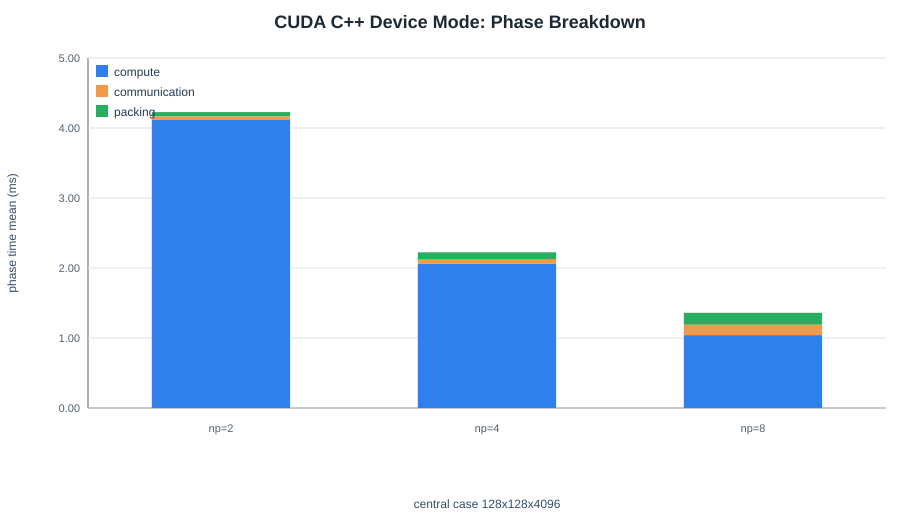
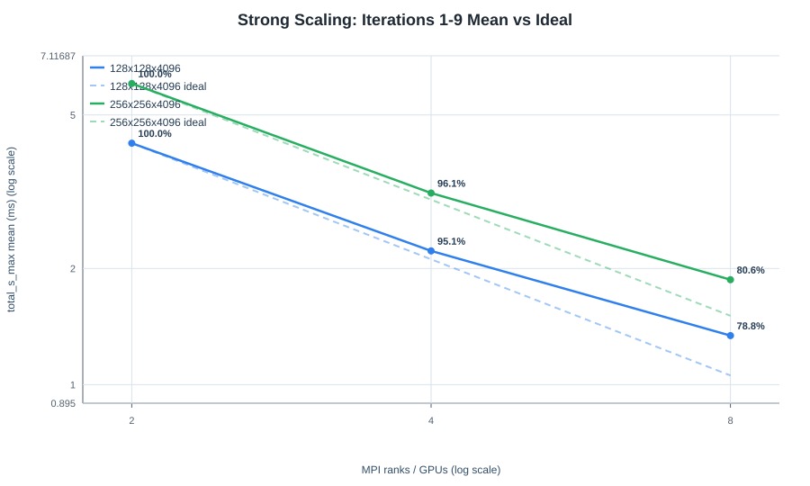
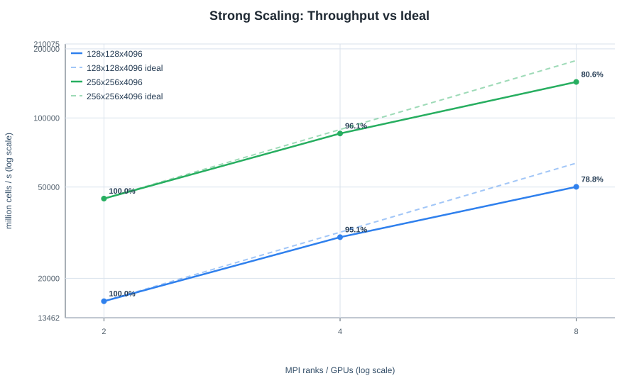
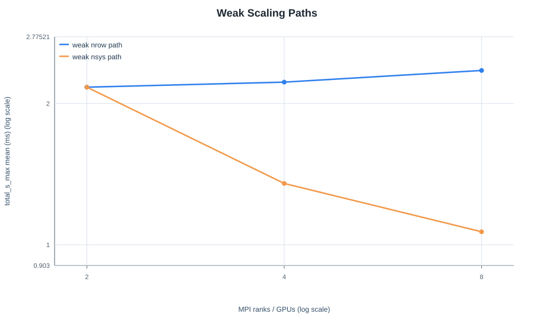
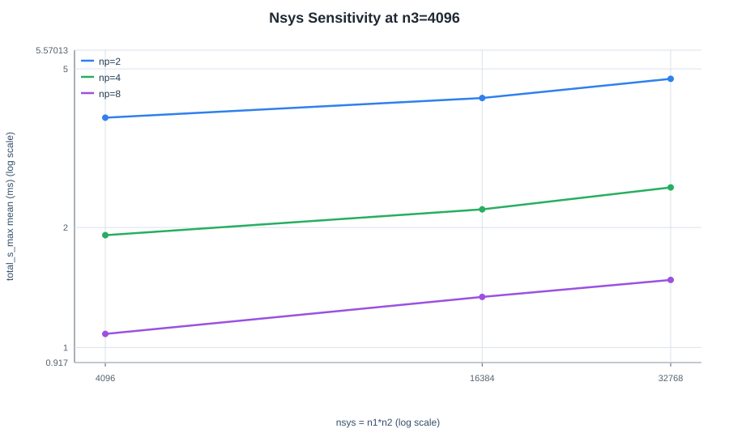
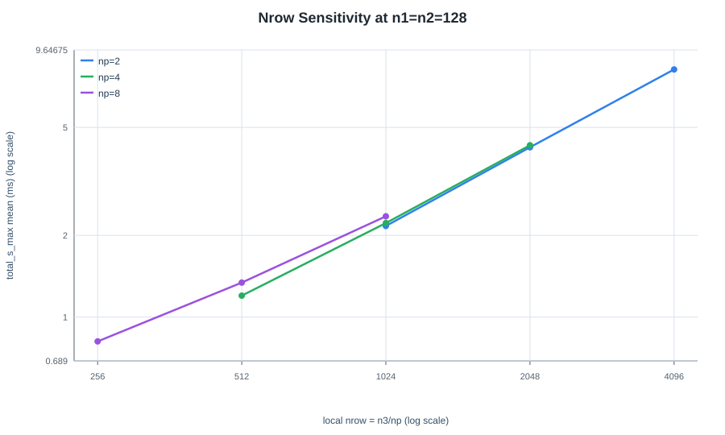
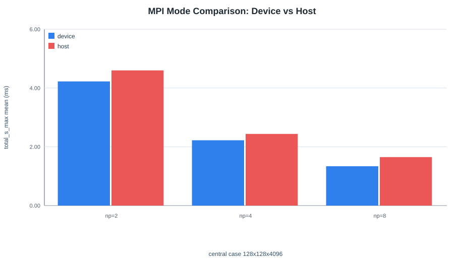
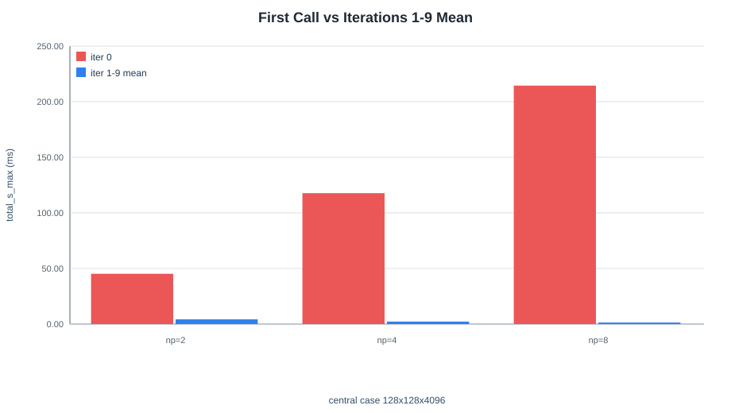

# CUDA C++ Port Study of an MPI-Parallel TDMA Solver

## Summary

This study evaluates a CUDA C++ port of an MPI-parallel TDMA solver originally organized around a CUDA Fortran codebase. The focus is not only whether the port runs, but whether it exposes the right engineering evidence: numerical correctness, phase-level timing, GPU scaling behavior, and the cost of CUDA-aware MPI device communication versus host fallback.

The current merged dataset contains CUDA C++ timing rows only. Therefore, this report does not claim a Fortran-vs-C++ timing comparison yet. It reports the current CUDA C++ port behavior and keeps the Fortran comparison as the next validation step once Fortran timing rows are merged.

Key findings:

- The iteration-0 CUDA C++ solution is numerically consistent with the expected solution across all 25 collected cases. The maximum absolute error is `8.860e-12`.
- For the central case `128x128x4096`, device-mode time improves from `4.225 ms` at 2 GPUs to `1.340 ms` at 8 GPUs.
- Strong scaling from the 2-GPU baseline reaches `3.154x` speedup and `78.8%` efficiency at 8 GPUs for `128x128x4096`.
- CUDA-aware device mode is consistently faster than host fallback for the central multi-GPU case. Host fallback is `1.089x`, `1.097x`, and `1.232x` slower at 2, 4, and 8 GPUs.
- Iteration 0 uses the original initialized inputs and includes first-call overhead. Iterations `1-9` operate on successively in-place-modified inputs because the drivers do not restore `A`, `C`, and `D`; their mean is an execution-path measurement under that protocol, not steady-state timing for repeated solves of the original system.

## Project Context

The original project is the CUDA Fortran + MPI implementation of PaScaL_TDMA
2.1, published as a multi-GPU tridiagonal solver in Computer Physics
Communications 323 (2026) 110120. The porting work reorganizes the published
solver into CUDA C++ while preserving the main numerical structure:

- many independent TDMA systems: `nsys = n1 * n2`
- each rank owns a balanced contiguous part of `n3`; local row lengths are `floor(n3 / nranks)` or `ceil(n3 / nranks)` and differ by at most one
- multi-GPU decomposition along the TDMA row direction
- reduced-system communication through MPI

The study is designed as a compact engineering case study: port an existing GPU solver, expose comparable solver interfaces, and analyze performance using reproducible scripts and CSV outputs.

## Repository Artifacts

- CUDA C++ profile example: `examples/example_cuda_cxx_profile.cu`
- Fortran profile example: `examples/example_fortran_profile.f90`
- Study runner: `tool/run_study_sweep.sh`
- Analysis script: `doc/study/result/analyze_study_results.py`
- Merged timing data: `doc/study/result/tdma_total_profile_merged_260702_merged.csv`
- Merged correctness data: `doc/study/result/tdma_correctness_merged_260702_merged.csv`
- Merged case manifest: `doc/study/result/tdma_case_manifest_merged_260702_merged.csv`
- Representative environment capture: `doc/study/result/tdma_environment_260702_175504.txt`
- Report tables: `doc/study/result/tables/`
- Report figures: `doc/study/result/figures/`

## Test Environment

| Item | Value |
| --- | --- |
| Date | 2026-07-02 |
| Host | `gpu56` |
| GPU | 8 x NVIDIA H200 |
| Driver | 580.105.08 |
| CUDA shown by driver | 13.0 |
| CUDA compiler | CUDA 12.9, `nvcc` V12.9.86 |
| MPI | Open MPI 4.1.9a1 |
| C++ compiler wrapper | `mpicxx` with `nvc++` 25.11 |
| Fortran compiler wrapper | `mpifort` with `nvfortran` 25.11 |
| Iterations per case | 10 |
| Timing statistics | iterations `1-9` under the in-place repetition protocol |

The GPU topology reported NVLink connectivity among the H200 GPUs. The study used `CUDA_VISIBLE_DEVICES` to control the number of visible GPUs for each MPI run.

## Data Coverage

| item | value |
| --- | --- |
| profile rows | 250 |
| profile cases | 25 |
| correctness rows | 25 |
| manifest rows | 25 |
| implementations in profile | cuda-cxx |
| implementations in correctness | cuda-cxx |
| MPI modes | device, host |
| Fortran timing rows present | no |

## Metrics

The main timing metric is `total_s_max`, the maximum elapsed time across MPI ranks. This is the relevant wall-time metric for synchronous multi-rank execution.

Additional metrics:

- `total_s_avg`: average time across MPI ranks
- `compute_s_max`: local TDMA, reduced-system compute, and update phases
- `communication_s_max`: MPI forward and backward communication
- `packing_s_max`: pack/unpack overhead around MPI exchange
- `throughput_Mcells_s = n1 * n2 * n3 / total_s_max / 10^6`
- strong-scaling speedup from 2-GPU baseline: `T2 / Tp`
- strong-scaling efficiency from 2-GPU baseline: `T2 / ((p / 2) * Tp)`

Line plots are rendered on log-log axes. For strong scaling, dashed curves show ideal scaling from the 2-GPU baseline, and point labels show the measured efficiency.

## Correctness

The test problem is constructed so that the expected solution is `1`. The iteration-0 CUDA C++ solution stays close to this reference over the tested grid sizes and MPI configurations. Correctness is not collected after iteration 0.

| Result | Value |
| --- | --- |
| Max absolute error over all cases | `8.860e-12` |
| Number of correctness cases | 25 |
| MPI modes covered | device, host |
| Rank counts covered | 1, 2, 4, 8 |

Full table: [result/tables/1_correctness_summary.md](result/tables/1_correctness_summary.md)

## Central Case Timing

The central case is `128x128x4096`. It is used as the common reference for phase breakdown, strong scaling, and MPI mode comparison.

All timing values below summarize iterations `1-9` under the current in-place
repetition protocol. They characterize that execution path; they are not
measurements of repeated independent solves with restored original inputs.

| case | mode | np | total_ms | compute_ms | comm_ms | packing_ms | throughput_Mcells_s |
| --- | --- | --- | --- | --- | --- | --- | --- |
| `128x128x4096` | device | 2 | 4.225 | 4.114 | 0.052 | 0.060 | 15884.7 |
| `128x128x4096` | device | 4 | 2.221 | 2.058 | 0.070 | 0.097 | 30214.4 |
| `128x128x4096` | device | 8 | 1.340 | 1.042 | 0.147 | 0.171 | 50095.9 |
| `128x128x4096` | host | 2 | 4.600 | 4.115 | 0.426 | 0.060 | 14590.3 |
| `128x128x4096` | host | 4 | 2.438 | 2.058 | 0.288 | 0.096 | 27531.7 |
| `128x128x4096` | host | 8 | 1.650 | 1.030 | 0.458 | 0.174 | 40677.0 |

The device-mode result shows that compute remains the dominant component, while communication and packing become more visible at 8 GPUs as each rank owns a shorter local row.

## Strong Scaling

Baseline is 2 GPUs.

| grid | np | total_ms | speedup_2base | efficiency_2base_percent | throughput_Mcells_s |
| --- | --- | --- | --- | --- | --- |
| `128x128x4096` | 2 | 4.225 | 1.000 | 100.0 | 15884.7 |
| `128x128x4096` | 4 | 2.221 | 1.902 | 95.1 | 30214.4 |
| `128x128x4096` | 8 | 1.340 | 3.154 | 78.8 | 50095.9 |
| `256x256x4096` | 2 | 6.031 | 1.000 | 100.0 | 44507.5 |
| `256x256x4096` | 4 | 3.137 | 1.922 | 96.1 | 85558.2 |
| `256x256x4096` | 8 | 1.870 | 3.225 | 80.6 | 143518.9 |

The log-log plots compare measured scaling against ideal 2-GPU-baseline scaling. The measured curves stay close to the ideal line from 2 to 4 GPUs, with `95.1%` and `96.1%` efficiency for the two strong-scaling cases. At 8 GPUs the efficiencies are `78.8%` and `80.6%`, showing that communication and orchestration overhead become more visible as local work per rank decreases. The larger `256x256x4096` case scales slightly better because the larger number of independent systems increases useful GPU work relative to communication and orchestration overhead.

## Weak Scaling

Two weak-scaling paths were measured:

- `weak_nrow`: keep `nsys` fixed and keep local `nrow` approximately constant as rank count increases.
- `weak_nsys`: increase `nsys` with rank count while reducing local `nrow`.

| path | np | grid | nsys | nrow | total_ms | throughput_Mcells_s |
| --- | --- | --- | --- | --- | --- | --- |
| weak_nrow | 2 | `128x128x2048` | 16384 | 1024 | 2.167 | 15483.8 |
| weak_nrow | 4 | `128x128x4096` | 16384 | 1024 | 2.221 | 30214.4 |
| weak_nrow | 8 | `128x128x8192` | 16384 | 1024 | 2.352 | 57068.5 |
| weak_nsys | 2 | `128x128x2048` | 16384 | 1024 | 2.167 | 15483.8 |
| weak_nsys | 4 | `128x256x2048` | 32768 | 512 | 1.351 | 49672.5 |
| weak_nsys | 8 | `128x512x2048` | 65536 | 256 | 1.066 | 125918.0 |

The weak-nrow path keeps runtime nearly flat while increasing total problem size. The weak-nsys path improves runtime because it exposes more independent systems while reducing local row length.

## Nsys Sensitivity

`nsys = n1 * n2` controls the number of independent TDMA systems. Increasing `nsys` improves throughput strongly, because more independent work is exposed to the GPU.

| np | nsys | grid | nrow | total_ms | throughput_Mcells_s |
| --- | --- | --- | --- | --- | --- |
| 2 | 4096 | `64x64x4096` | 2048 | 3.772 | 4447.6 |
| 2 | 16384 | `128x128x4096` | 2048 | 4.225 | 15884.7 |
| 2 | 32768 | `128x256x4096` | 2048 | 4.720 | 28433.2 |
| 4 | 4096 | `64x64x4096` | 1024 | 1.914 | 8766.3 |
| 4 | 16384 | `128x128x4096` | 1024 | 2.221 | 30214.4 |
| 4 | 32768 | `128x256x4096` | 1024 | 2.520 | 53251.4 |
| 8 | 4096 | `64x64x4096` | 512 | 1.082 | 15507.8 |
| 8 | 16384 | `128x128x4096` | 512 | 1.340 | 50095.9 |
| 8 | 32768 | `128x256x4096` | 512 | 1.477 | 90853.0 |

## Nrow Sensitivity

The local TDMA row length is `floor(n3 / nranks)` or `ceil(n3 / nranks)`. All cases in the table below are divisible, so their local lengths equal `n3 / nranks`. Increasing `nrow` increases total runtime almost linearly, while throughput remains roughly constant or improves because each rank performs more useful work per communication step.

| np | nrow | grid | total_ms | comm_percent_of_total | throughput_Mcells_s |
| --- | --- | --- | --- | --- | --- |
| 2 | 1024 | `128x128x2048` | 2.167 | 2.4 | 15483.8 |
| 2 | 2048 | `128x128x4096` | 4.225 | 1.2 | 15884.7 |
| 2 | 4096 | `128x128x8192` | 8.175 | 0.8 | 16417.6 |
| 4 | 512 | `128x128x2048` | 1.199 | 6.3 | 27978.7 |
| 4 | 1024 | `128x128x4096` | 2.221 | 3.2 | 30214.4 |
| 4 | 2048 | `128x128x8192` | 4.296 | 1.9 | 31243.5 |
| 8 | 256 | `128x128x2048` | 0.814 | 17.7 | 41243.5 |
| 8 | 512 | `128x128x4096` | 1.340 | 11.0 | 50095.9 |
| 8 | 1024 | `128x128x8192` | 2.352 | 5.4 | 57068.5 |

The communication percentage is highest when local rows are short, especially at 8 GPUs. This is expected: the fixed MPI and packing overhead is spread over less local work.

## MPI Device Mode vs Host Fallback

| np | mode | total_ms | compute_ms | comm_ms | packing_ms | host_over_device |
| --- | --- | --- | --- | --- | --- | --- |
| 2 | device | 4.225 | 4.114 | 0.052 | 0.060 | - |
| 2 | host | 4.600 | 4.115 | 0.426 | 0.060 | 1.089 |
| 4 | device | 2.221 | 2.058 | 0.070 | 0.097 | - |
| 4 | host | 2.438 | 2.058 | 0.288 | 0.096 | 1.097 |
| 8 | device | 1.340 | 1.042 | 0.147 | 0.171 | - |
| 8 | host | 1.650 | 1.030 | 0.458 | 0.174 | 1.232 |

Device mode reduces MPI communication time substantially. The effect becomes more important at 8 GPUs, where the host fallback path is about `23.2%` slower than device mode for the central case.

## Repetition and first-call timing boundary

For the central device-mode case at 8 GPUs, iteration 0 takes `214.406 ms`,
while the iterations `1-9` mean is `1.340 ms`. Iteration 0 is the solve that
uses the original initialized inputs and it also includes first-call overhead.
After that call, the coefficient and right-hand-side arrays have been modified
in place. Because the driver does not restore them, the later calls operate on
successively transformed buffers.

The timing difference therefore cannot be assigned solely to GPU warm-up, and
the iterations `1-9` mean must not be interpreted as steady-state timing for
repeated solves of an identical system. The complete repetition tables are
available here:

- [result/tables/8_reproducibility_top_cv.md](result/tables/8_reproducibility_top_cv.md)
- [result/tables/9_warmup_effect_top.md](result/tables/9_warmup_effect_top.md)

## Scope of Current Dataset

The merged result set currently contains only `cuda-cxx` rows. The study infrastructure includes a Fortran profiling example, but the merged report data does not yet include `fortran-original` timing rows.

The next report revision should add:

- Fortran correctness rows in the same case matrix
- Fortran timing rows for the central, strong-scaling, and sensitivity cases
- direct Fortran vs CUDA C++ timing tables
- a short discussion of any API, layout, or memory-transfer differences that explain performance differences

## Conclusion

The iteration-0 CUDA C++ results establish numerical correctness against the
expected-one test for the 25 collected cases. Iterations `1-9` show multi-GPU
execution-path scaling under the current in-place repetition protocol,
including lower measured time for device-direct MPI than host staging in the
tested cases. They do not establish timing for repeated identical solves.

As an engineering artifact, this study provides a reproducible structure for
porting a GPU solver, recording correctness, and instrumenting compute and
communication phases. A future repeated-solve performance study should restore
the original arrays before every measured call and should add corresponding
CUDA Fortran result rows before making a language-to-language comparison.
